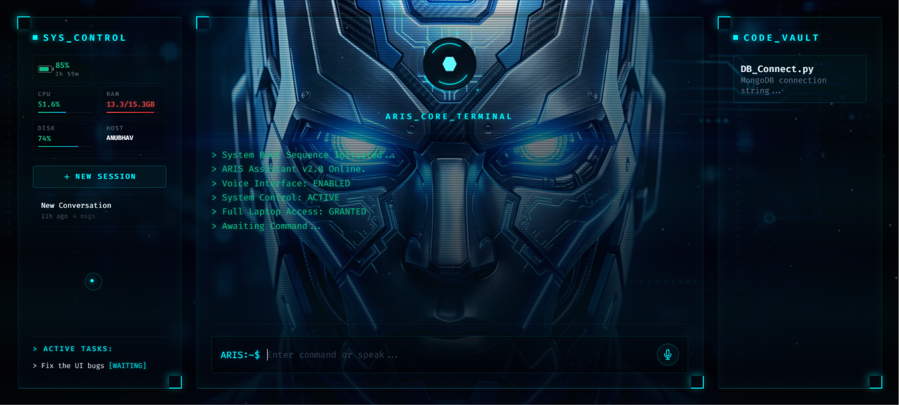

# ⚡ CYBER-COCKPIT — Futuristic Personal Desktop AI Assistant

A futuristic AI-powered desktop assistant with a cyberpunk-inspired interface.  
Built with **FastAPI**, **Groq API**, **MongoDB**, and an advanced animated frontend.

CYBER-COCKPIT is designed as a next-generation personal AI workspace where users can interact with an intelligent assistant through a beautiful sci-fi terminal interface.

---

## 🚀 Features

- 🤖 AI Chat Assistant powered by Groq API
- 🎙️ Voice command support
- 💬 Real-time conversation history
- 🧠 Context-aware AI interactions
- 🗄️ MongoDB chat storage
- ⚡ FastAPI backend
- 🌌 Futuristic Cyberpunk UI
- 🎨 Advanced VFX animations
- 📊 System monitoring widgets
- 🔒 Secure environment variable support

---

# 📸 UI Preview

## Main Interface
(Add screenshot here)

```md

```

---

# 🛠 Tech Stack

## Frontend
- HTML5
- CSS3
- JavaScript
- Neon HUD UI
- VFX Engine

## Backend
- FastAPI
- Uvicorn
- Python

## AI Model
- Groq API

## Database
- MongoDB

---

# 📂 Project Structure

```bash
CYBER-COCKPIT/
│
├── backend/
│   ├── app/
│   │   ├── api/
│   │   │   ├── chat.py
│   │   │   ├── conversations.py
│   │   │   ├── snippets.py
│   │   │   ├── system_control.py
│   │   │   └── tasks.py
│   │   │
│   │   ├── models/
│   │   ├── services/
│   │   ├── config.py
│   │   ├── database.py
│   │   └── main.py
│   │
│   └── requirements.txt
│
├── frontend/
│   ├── assets/
│   │   ├── css/
│   │   ├── images/
│   │   └── js/
│   │
│   └── index.html
│
├── .env
├── .env.example
├── .gitignore
└── README.md
```

---

# ⚙️ Installation

## 1 Clone Repository

```bash
git clone https://github.com/Anubhav2321/Personal_desktop_ai.git
cd cyber-cockpit
```

---

## 2 Create Virtual Environment

```bash
python -m venv venv
```

Activate:

### Windows
```bash
venv\Scripts\activate
```

### Linux / Mac
```bash
source venv/bin/activate
```

---

## 3 Install Dependencies

```bash
pip install -r backend/requirements.txt
```

---

## 4 Setup Environment Variables

Create `.env`

```env
GROQ_API_KEY=your_groq_api_key
MONGO_URI=your_mongodb_connection_string
DATABASE_NAME=cyber_cockpit
```

---

# ▶️ Run Backend Server

```bash
python -m uvicorn backend.app.main:app --reload
```

Server runs at:

```bash
http://127.0.0.1:8000
```

---

# 🌐 Run Frontend

Open:

```bash
frontend/index.html
```

OR use Live Server in VS Code.

---

# 🔌 API Endpoints

## Chat Endpoint
```http
POST /api/chat
```

### Request
```json
{
  "message": "Hello ARIS"
}
```

### Response
```json
{
  "reply": "Hello, how can I help you?"
}
```

---

# 👨‍💻 Developer

## Anubhav Samanta

AI Developer | Python Developer | Full Stack Builder  

Focused on:
- AI Systems
- Futuristic Interfaces
- Automation
- Personal Desktop Assistants

GitHub:  
https://github.com/Anubhav2321

---

# 🔮 Future Plans

- Face recognition login  
- Voice assistant upgrade  
- Desktop control  
- File system access  
- Smart automation  
- AI memory system  

---

# 📜 License

MIT License

---

# ⭐ Support

If you like this project, give it a star on GitHub.
